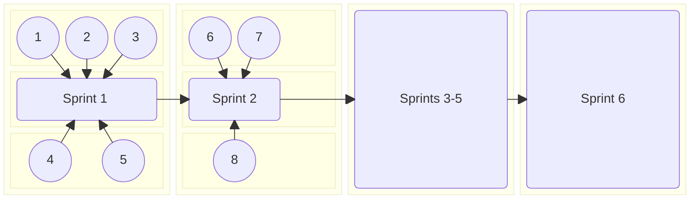

# mermaid_testing
Test Mermaid Diagrams

```mermaid
---
config:
  layout: elk
  theme: dark
---
  block-beta
    columns 9
    block:LEFT:4
      columns 1
      A1(("&nbsp;&nbsp;&nbsp; 1 &nbsp;&nbsp;&nbsp;"))
      A2(("&nbsp;&nbsp;&nbsp; 2 &nbsp;&nbsp;&nbsp;"))
      A3(("&nbsp;&nbsp;&nbsp; 3 &nbsp;&nbsp;&nbsp;"))
      A6(("&nbsp;&nbsp;&nbsp; 6 &nbsp;&nbsp;&nbsp;"))
      A8(("&nbsp;&nbsp;&nbsp; 8 &nbsp;&nbsp;&nbsp;"))
      A10(("&nbsp;&nbsp;&nbsp; 10 &nbsp;&nbsp;&nbsp;"))
    end
    
    block:CENTER:1
      columns 1
      space
      space
      space
      space
      SPRINT1("Sprint 1&nbsp;")
      space
      space
      space
      space
      space
      space
      space
      space
      SPRINT2("Sprint 2")
      space
      space
      space
      space
      SPRINT35("Sprints 3-5")
      space
      space
      SPRINT6("Sprint 6")
      space
    end
    
    block:RIGHT:4
      columns 1
      A4(("&nbsp;&nbsp;&nbsp; 4 &nbsp;&nbsp;&nbsp;"))
      A5(("&nbsp;&nbsp;&nbsp; 5 &nbsp;&nbsp;&nbsp;"))
      A7(("&nbsp;&nbsp;&nbsp; 7 &nbsp;&nbsp;&nbsp;"))
      A9(("&nbsp;&nbsp;&nbsp; 9 &nbsp;&nbsp;&nbsp;"))
    end

    SPRINT1 --> SPRINT2
    SPRINT2 --> SPRINT35
    SPRINT35 --> SPRINT6
    A1 -- "Meet team &</br>schedule Kickoff" --> SPRINT1
    A2 -- "Conduct Kickoff</br>Meeting" --> SPRINT1
    A3 -- "Update team list</br>in readme.md" --> SPRINT1
    A4 -- "Choose project &</br>define Vision stmt." --> SPRINT1
    A5 -- "Define & prioritize</br>features" --> SPRINT1
    A6 -- "Create Product</br>Backlog" --> SPRINT2
    A7 -- "Create wireframe" --> SPRINT2
    A8 -- "Setup team</br>workflow" --> SPRINT2
    A9 -- "Design, code,</br>test, & deploy app" --> SPRINT35
    A10 -- "Project Closure" --> SPRINT6

    style LEFT fill:#34495e
    style CENTER fill:#34495e
    style RIGHT fill:#34495e
    style A1 fill:#1d8348
    style A2 fill:#1d8348
    style A3 fill:#1d8348
    style A4 fill:#1d8348
    style A5 fill:#1d8348
    style A6 fill:#1d8348
    style A7 fill:#1d8348
    style A8 fill:#1d8348
    style A9 fill:#1d8348
    style A10 fill:#1d8348
    style SPRINT1 fill:#1b4f72
    style SPRINT2 fill:#1b4f72
    style SPRINT35 fill:#1b4f72
    style SPRINT6 fill:#1b4f72
```

```mermaid
  block-beta
    columns 4
    block:B1:1
      columns 1
      block:B1TOP
        A1(("&nbsp;&nbsp;&nbsp; 1 &nbsp;&nbsp;&nbsp;"))
        A2(("&nbsp;&nbsp;&nbsp; 2 &nbsp;&nbsp;&nbsp;"))
        A3(("&nbsp;&nbsp;&nbsp; 3 &nbsp;&nbsp;&nbsp;"))
      end
      block:B1CENTER
        SPRINT1("Sprint 1&nbsp;")
      end
      block:B1BOTTOM
        A4(("&nbsp;&nbsp;&nbsp; 4 &nbsp;&nbsp;&nbsp;"))
        A5(("&nbsp;&nbsp;&nbsp; 5 &nbsp;&nbsp;&nbsp;"))
      end
      A1 ----> SPRINT1
      A2 ----> SPRINT1
      A3 ----> SPRINT1
      A4 ----> SPRINT1
      A5 ----> SPRINT1
    end

    block:B2:1
      columns 1
      block:B2TOP
        A6(("&nbsp;&nbsp;&nbsp; 6 &nbsp;&nbsp;&nbsp;"))
        A7(("&nbsp;&nbsp;&nbsp; 7 &nbsp;&nbsp;&nbsp;"))
      end
      block:B2CENTER
        SPRINT2("Sprint 2")
      end
      block:B2BOTTOM
        A8(("&nbsp;&nbsp;&nbsp; 8 &nbsp;&nbsp;&nbsp;"))
      end
      A6 ----> SPRINT2
      A7 ----> SPRINT2
      A8 ----> SPRINT2
    end

    block:B3:1
      SPRINT35("Sprints 3-5")
    end

    block:B4:1
      SPRINT6("Sprint 6")
    end

    SPRINT1 --> SPRINT2
    SPRINT2 --> SPRINT35
    SPRINT35 --> SPRINT6

```