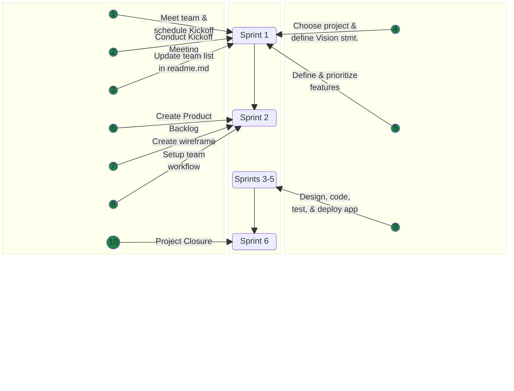

# mermaid_testing
Test Mermaid Diagrams

```mermaid
  block-beta
    columns 9
    block:LEFT:4
      columns 1
      A1(("1"))
      space
      A2(("2"))
      space
      A3(("3"))
      space
      A6(("6"))
      space
      A7(("7"))
      space
      A8(("8"))
      space
      A10(("10"))
    end
    
    block:CENTER:1
      columns 1
      space
      SPRINT1("Sprint 1")
      space
      space
      space
      SPRINT2("Sprint 2")
      space
      space
      SPRINT35("Sprints 3-5")
      space
      space
      SPRINT6("Sprint 6")
    end
    
    block:RIGHT:4
      columns 1
      A4(("4"))
      space
      A5(("5"))
      space
      A9(("9"))
    end

    SPRINT1 --> SPRINT2
    SPRINT35 --> SPRINT6

    A1 -- "Meet team &</br>schedule Kickoff" --> SPRINT1
    A2 -- "Conduct Kickoff</br>Meeting" --> SPRINT1
    A3 -- "Update team list</br>in readme.md" --> SPRINT1
    A4 -- "Choose project &</br>define Vision stmt." --> SPRINT1
    A5 -- "Define & prioritize</br>features" --> SPRINT1
    A6 -- "Create Product</br>Backlog" --> SPRINT2
    A7 -- "Create wireframe" --> SPRINT2
    A8 -- "Setup team</br>workflow" --> SPRINT2
    A9 -- "Design, code,</br>test, & deploy app" --> SPRINT35
    A10 -- "Project Closure" --> SPRINT6

    style A1 fill:#1d8348
    style A2 fill:#1d8348
    style A3 fill:#1d8348
    style A4 fill:#1d8348
    style A5 fill:#1d8348
    style A6 fill:#1d8348
    style A7 fill:#1d8348
    style A8 fill:#1d8348
    style A9 fill:#1d8348
    style A10 fill:#1d8348

```