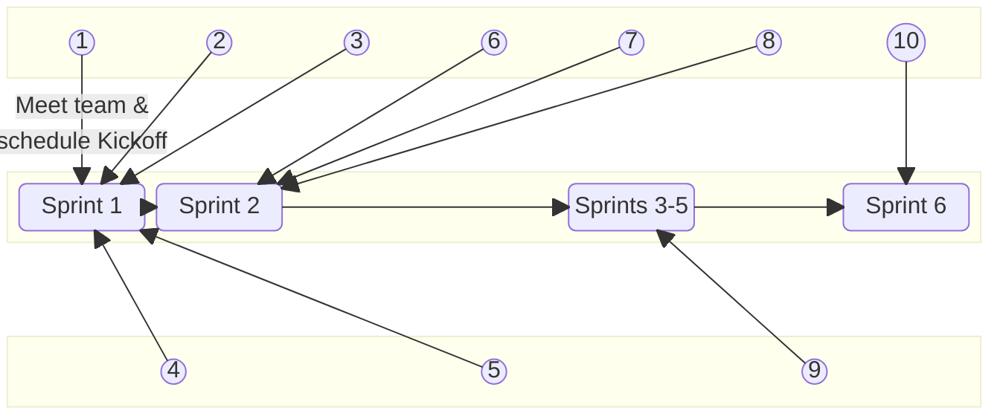

# mermaid_testing
Test Mermaid Diagrams

```mermaid
  block-beta
    columns 1
    block:ANNOTATIONSTOP
      A1(("1"))
      A2(("2"))
      A3(("3"))
      A6(("6"))
      A7(("7"))
      A8(("8"))
      A10(("10"))
    end
    space
    block:SPRINTS
      SPRINT1("Sprint 1") --> SPRINT2("Sprint 2")
      space
      space
      SPRINT2 --> SPRINT35("Sprints 3-5")
      space
      SPRINT35 --> SPRINT6("Sprint 6")
    end
    space
      block:ANNOTATIONSBOTTOM
      A4(("4"))
      A5(("5"))
      A9(("9"))
    end
    A1 -- "Meet team &</br>schedule Kickoff" --> SPRINT1
    A2 ----> SPRINT1
    A3 ----> SPRINT1
    A4 ----> SPRINT1
    A5 ----> SPRINT1
    A6 ----> SPRINT2
    A7 ----> SPRINT2
    A8 ----> SPRINT2
    A9 ----> SPRINT35
    A10 ----> SPRINT6
```